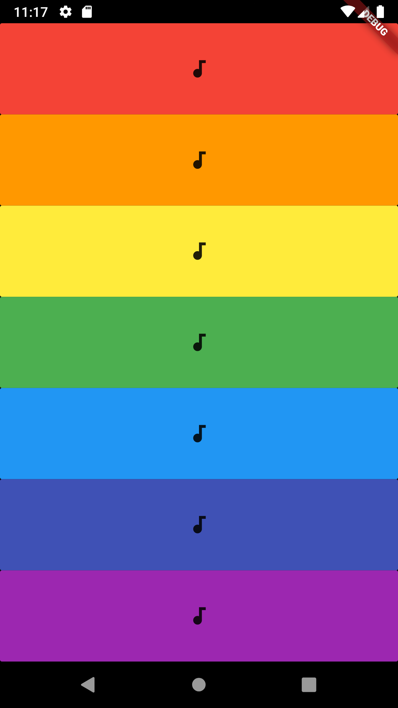

# xylophone-app

A simple application that lets you play a xylophone.

# Introduction
Now this a again an simple app which I made to play audio with the help of an imported package , new things in the code I learnt are using function to return widget , passing widgets or different class objects as a named parameter and make my code less repitative. 
New things I will introduce
- As I learn more I would have piano and different musical instruments as well

# visuals
Icon:

Homepage:

## Getting Started

This project is a starting point for a Flutter application.

A few resources to get you started if this is your first Flutter project:

- [Lab: Write your first Flutter app](https://flutter.dev/docs/get-started/codelab)
- [Cookbook: Useful Flutter samples](https://flutter.dev/docs/cookbook)

For help getting started with Flutter, view our
[online documentation](https://flutter.dev/docs), which offers tutorials,
samples, guidance on mobile development, and a full API reference.
